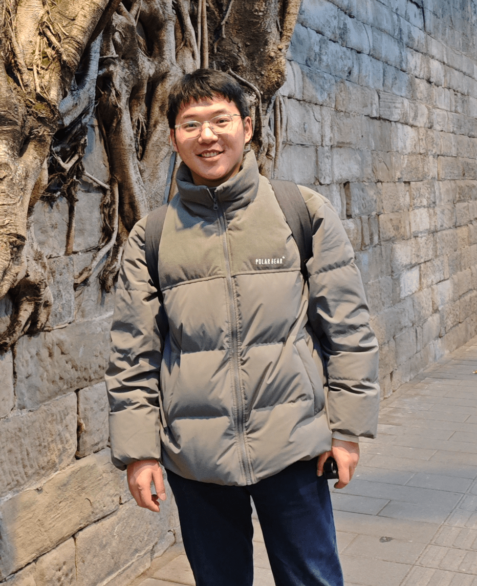

  <!-- 左边的图片 -->
  

    
  

  <!-- 右边的文字介绍 -->
  

    <h3>胡建</h3>
    
<strong>研究方向：</strong>风力机整机动力学分析、风电场组协同优化控制。

    
<strong>个人简介：</strong>1999年4月生，籍贯湖南省常德市。2016-2020年就读于湖南大学力学系工程力学专业；后就职于中联重科股份有限公司，从事CAE相关工作；2024年9月至今在汕头大学工学院机械工程系读研，对风力机动力学有浓厚研究兴趣。

    
<strong>联系方式：</strong><a href="mailto:lisi@example.com">24jhu@stu.edu.cn</a>

	
<strong>科研项目：</strong>2025年广东省科技创新战略专项资金项目，“智驭风澜：边云协同风力机高效增功产品”，2025.3-2027.3，主持。

	
<strong>知识产权：</strong>郜志腾, 胡建, 孙敬伟, et al. 基于分层优化的风电场偏航控制方法、系统、装置和介质[P]. ZL202510247132.2（发明专利）

  

